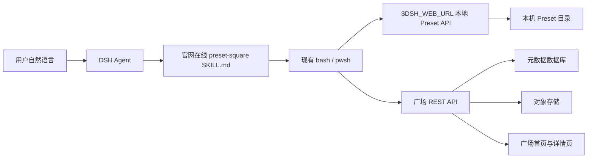

# DSH Preset 广场 MVP 技术方案

## 1. 目标与范围

MVP 只解决两个自然语言动作：

1. 用户对 DSH 说“把 `tender-extract` 发布到广场，邮箱是 `name@example.com`”，DSH 将该 Preset 打包、上传，并返回公开详情页链接。
2. 用户把广场详情页链接交给 DSH 并说“安装这个 Preset”，DSH 读取元数据、下载包、校验并导入本机。

广场网站只需要：

- 首页默认按下载量倒序展示全部 Preset，并可切换为按上传时间倒序；
- Preset 详情页；
- 标题、描述、发布时间、发布者用户名和下载入口；
- 接收发布、返回元数据和下载文件的 API。

MVP 不做搜索、分页、账号系统、邮箱验证、评论、评分、更新、版本管理和在线编辑。由于没有身份验证，每次非重复发布都创建一个不可变的新条目，不允许发布者覆盖或删除旧条目；管理员保留隐藏恶意内容的能力。

## 2. 关键设计决定

### 2.1 复用现有 `.dshpreset` 格式

广场不定义第二种包格式。继续使用 DSH Desktop 已实现的 `.dshpreset` ZIP：

```text
manifest.json
preset/
├── agent.cordis.yml
└── ...
```

标题默认取 `manifest.name`，没有时取 `manifest.id`；描述默认取 `manifest.description`。用户在发布指令中给出的标题和描述可以覆盖广场展示文案，但不修改包内容。

发布者邮箱只存于广场数据库，不能写入 `.dshpreset`，避免下载者获得发布者的完整邮箱。公开用户名取邮箱 `@` 前面的部分，例如 `ray@example.com` 显示为 `ray`；不公开邮箱域名和验证状态。

### 2.2 在线 Skill，不做自然语言意图解析器

广场在官网以独立 Markdown 文件托管完整的 `preset-square` Skill，不把它随 DSH Desktop 安装，也不新增 Cordis Plugin 或模型 Tool。用户第一次接入时，将一段很短的引导语发送给 DSH，明确要求读取该 `SKILL.md`、暂不执行操作并等待下一条指令。DSH 通过已有的 HTTP 与 shell 能力读取正文；后续的查找、安装和发布都在同一个会话中遵循这份正文。

生产 Skill 地址为：

```text
https://www.dshdesktop.com/preset/skills/preset-square/SKILL.md
```

本地开发可以使用显式的 loopback 地址，例如 `http://127.0.0.1:4310/skills/preset-square/SKILL.md`。在线 Skill 只在当前会话上下文中生效；新会话需要重新读取。这样官网可以独立修订广场 API 工作流，客户端不需要因为 Skill 文案变化而发版。

DSH Web 已向 shell 暴露 `$DSH_WEB_URL`，Skill 可以稳定访问当前随机端口上的本地服务。现有本地 API 继续负责 ZIP 打包、预览、路径校验和原子安装；Skill 不自行解压 `.dshpreset`，也不复制安全逻辑。

模型只负责遵循用户明确指定的在线 Skill、补齐缺失信息并向用户解释结果。网站首页提供“连接 DSH”的可复制引导语；读取完成后，用户再发送查找、安装或发布指令。网站不把整份 Skill 正文复制进剪贴板，也不假设客户端已经注册了名为 `preset-square` 的本地 Skill。

### 2.3 只支持广场自己的详情页链接

MVP 的 Skill 只接受配置中的广场域名及固定路径，例如：

```text
https://square.dsh.example/p/tender-extract-a1b2c3
```

Skill 从路径提取 slug，再请求广场 JSON API。暂不接受任意 `.zip` URL，避免 SSRF、内网探测、无限重定向和不可信下载源问题。

### 2.4 重名与重复内容规则

广场中正在展示的 Preset 标题必须全局唯一，避免后来上传的内容使用相同名字冒充原 Preset。`manifest.id` 仍不做全局唯一校验，因为它是安装到本机时使用的技术 ID，不适合作为公开品牌身份。

服务端为标题生成 `title_key`，并以它做唯一校验：

1. Unicode NFC 规范化；
2. 去掉首尾空白；
3. 拒绝控制字符和用于隐藏文本的不可见格式字符；
4. 保留大小写、内部空格和标点符号的差异。

因此 `Research Agent`、`research-agent` 和 `RESEARCH_AGENT` 可以作为三个不同名称存在；只有规范化后完全相同的展示标题才视为重名。重名发布返回 `409 PRESET_NAME_TAKEN` 和已有详情页。数据库索引必须使用区分大小写的比较规则。

服务端还应维护可配置的保留名称表，包括官方品牌词、内置 Preset 名称，以及 `Official`、`官方`、`认证` 等容易造成官方身份误解的词。普通发布接口不能使用保留名称；官方内容由管理员通道发布。

这只能防止完全重名，不能阻止相似名称仿冒或“先抢注”。邮箱尚未验证期间，名称归属是临时的：页面只显示由邮箱前缀派生的用户名，不展示“邮箱未验证”标记；管理员可以根据申诉隐藏冒名条目并释放名称。未来启用邮箱验证后，再将 `title_key` 与已验证发布者 ownership 绑定。

真正需要阻止的是完全相同的 Preset 内容被反复发布：

- `slug` 始终由服务端使用 `slugify(title) + short UUID` 生成并保持唯一；
- 服务端计算下载文件的 `artifact_sha256`，用于下载完整性校验；
- 服务端另行计算 `preset_content_sha256`：按路径排序后，对 `preset/**` 的路径、长度和文件内容做确定性摘要；
- `preset_content_sha256` 建唯一索引。这样即使 `manifest.exportedAt` 不同，同一份 Preset 内容仍会被识别为重复；
- 重复发布返回 `409 DUPLICATE_PRESET_CONTENT`，同时返回已有条目的 `detailUrl`，DSH 直接告诉用户“该内容已经在广场”，而不是再创建一张重复卡片。

本地安装仍按 Preset ID 做冲突校验：同名时要求选择新 ID，绝不覆盖已有目录。广场标题唯一性与本地安装 ID 冲突是两条独立规则。

## 3. 总体架构



本地设置 UI 和 Skill 都复用已经存在的 `/api/agent-preset.export`、`/api/agent-preset.import`。Skill 只做 HTTP 编排，不直接读写 Preset 目录。

## 4. DSH Desktop 侧

### 4.1 Skill 交付形态

`preset-square` 由广场网站以一个可直接读取的 UTF-8 Markdown 文件交付。DSH Desktop 不复制或缓存这份文件到 `$DSH_HOME/skills`，也不设置 `DSH_BUNDLED_SKILL_DIR`。用户明确提供 Skill URL 后，Agent 使用当前模式已有的 HTTP 或 shell 能力读取正文；只要求“读取”时必须回复已准备好并停止，不能提前浏览、下载、导入、导出或发布。

Skill 使用已有 `bash`（macOS）或 `pwsh`（Windows），不注册新的模型 Tool，也不要求 `dsh` 命令可执行。命令只负责参数转义、临时文件清理、HTTP 状态检查和 SHA-256 对比；不能自行解压或写入 Preset 目录。

当前官方 Standard、Code 和 Cordis/Creator Preset 已包含 Skill 能力。Minimal Preset 不加载 Skill 系统，因此 MVP 明确只支持具备 Skill 与 shell 能力的 Preset；不要为了广场改变 Minimal 的产品边界。

### 4.2 发布流程

1. 用户明确要求发布某个自定义 Preset；缺少邮箱时只追问邮箱。
2. Skill 通过以下本地接口导出到系统临时目录：

   ```text
   GET $DSH_WEB_URL/api/agent-preset.export?agentPreset=<id>
   ```

3. Skill 将刚导出的包提交给本地 import preview 接口，仅用于读取 `possible-secrets`、`absolute-paths` 和版本提示，不执行安装：

   ```text
   POST $DSH_WEB_URL/api/agent-preset.import
   Content-Type: application/vnd.dsh.preset+zip
   ```

4. 若存在危险警告，停止并征求用户确认；没有警告且用户已经明确要求发布时，不重复确认。
5. 使用 multipart/form-data 调用广场 `POST /api/v1/presets`，上传包、标题、描述和邮箱。
6. 返回公开详情页链接并删除临时文件。重名或重复内容时返回广场已有详情页。

### 4.3 安装流程

1. Skill 校验详情页 URL 必须属于配置的广场域名和 `/p/:slug` 路径。
2. 请求详情 API，获得同源下载地址、文件大小和 SHA-256。
3. 下载到系统临时目录，限制响应大小并核对 SHA-256。
4. 调用本地 preview 接口展示名称、文件数、版本差异、危险警告和 ID 冲突。
5. 用户已经明确说“安装”时可以继续；只有危险警告、版本不兼容或 ID 冲突才中断询问。
6. 调用以下接口完成原子安装，绝不直接解压：

   ```text
   POST $DSH_WEB_URL/api/agent-preset.import?agentPreset=<targetId>&install=1
   Content-Type: application/vnd.dsh.preset+zip
   ```

7. 返回安装结果并清理临时文件。新 Preset 无需重启，对新会话立即可见。

只发链接或说“看看”时，Skill 只读取详情 API，不下载和安装。

### 4.4 网站复制文案

首页提供“连接 DSH”按钮。中文引导语为：

```text
请读取并遵循这个 Preset Square Skill，暂时不要执行任何操作。读完后告诉我你已准备好，并等待我的下一条指令：https://www.dshdesktop.com/preset/skills/preset-square/SKILL.md
```

本地开发环境可把 URL 替换为：

```text
http://127.0.0.1:4310/skills/preset-square/SKILL.md
```

DSH 回复已准备好后，用户再发送操作指令，例如：

```text
安装这个 Preset：
https://www.dshdesktop.com/preset/p/tender-extract-a1b2c3
```

页面只显示当前语言对应的一条引导语，不同时展示中英文。Skill 正文集中配置 `baseUrl`、`apiBaseUrl` 和允许域名；生产环境只允许官方 HTTPS 域名，loopback 仅用于用户明确给出的本地开发地址。

## 5. 广场服务侧

### 5.1 推荐最小技术形态

- 一个 Web 应用同时提供页面与 REST API；
- PostgreSQL 保存元数据；
- S3/R2 等对象存储保存 `.dshpreset`；
- 可用 Next.js/Node.js 实现，但 API 合同不依赖具体框架。

不建议把包放在 serverless 实例本地磁盘；实例更新或扩容后文件可能丢失。若只做单机内部原型，可暂用 SQLite + 本地磁盘，但 API 和数据模型保持一致。

### 5.2 数据表

```sql
presets (
  id                         uuid primary key,
  slug                       varchar unique not null,
  preset_id                  varchar not null,
  title                      varchar(160) not null,
  title_key                  varchar(200) not null,
  description                text not null default '',
  publisher_email            varchar(254) not null,
  publisher_username         varchar(128) not null,
  publisher_email_verified   boolean not null default false,
  artifact_key               varchar not null,
  artifact_sha256            char(64) not null,
  preset_content_sha256      char(64) unique not null,
  artifact_size_bytes        integer not null,
  download_count             bigint not null default 0,
  manifest_json              jsonb not null,
  status                     varchar not null default 'published',
  created_at                 timestamptz not null default now()
)
```

`status` 首版只需 `published | hidden`。`publisher_username` 在发布时从邮箱 `@` 前面的部分生成并保存，例如 `name@example.com` 生成 `name`。完整邮箱和 `publisher_email_verified` 仅供未来验证及管理员使用；公开 API 只返回用户名，不返回邮箱、邮箱域名或验证状态。用户名不是唯一身份，不需要建立唯一索引。

至少建立以下索引：

```sql
unique (slug)
unique (preset_content_sha256)
unique (title_key) where status = 'published'
index  (status, download_count desc, created_at desc)
index  (status, created_at desc)
```

`title_key` 使用只约束 `published` 条目的部分唯一索引。管理员将冒名条目标记为 `hidden` 后，该名称即可重新发布，同时保留原记录供审计。

### 5.3 REST API

#### 发布

```http
POST /api/v1/presets
Content-Type: multipart/form-data

artifact=<file.dshpreset>
title=Tender Extract
description=Extracts tender parameters and produces deliverables.
publisherEmail=name@example.com
```

成功返回 `201`：

```json
{
  "id": "5e79...",
  "slug": "tender-extract-a1b2c3",
  "presetId": "tender-extract",
  "title": "Tender Extract",
  "description": "Extracts tender parameters and produces deliverables.",
  "publisher": {
    "username": "name"
  },
  "artifact": {
    "downloadUrl": "https://square.dsh.example/api/v1/presets/tender-extract-a1b2c3/download",
    "sha256": "...",
    "sizeBytes": 12345,
    "formatVersion": 1,
    "sourceDshVersion": "0.1.0-rc.7"
  },
  "detailUrl": "https://square.dsh.example/p/tender-extract-a1b2c3",
  "downloadCount": 0,
  "createdAt": "2026-08-14T12:00:00.000Z"
}
```

服务端必须在写对象存储前完成：邮箱格式、标题/描述长度、标题规范化与保留名检查、`title_key` 唯一检查、压缩包大小、ZIP 路径、文件数量、解压大小、`manifest.json` 格式、`preset/agent.cordis.yml` 存在性和 `preset_content_sha256` 重复检查。服务端不能加载或执行 Preset。

重名返回 `409`：

```json
{
  "error": {
    "code": "PRESET_NAME_TAKEN",
    "message": "A published preset already uses this name."
  },
  "existing": {
    "slug": "research-agent-a1b2c3",
    "detailUrl": "https://square.dsh.example/p/research-agent-a1b2c3"
  }
}
```

重复内容返回 `409`，响应中带已有条目，便于 DSH 直接复用链接：

```json
{
  "error": {
    "code": "DUPLICATE_PRESET_CONTENT",
    "message": "The same preset content has already been published."
  },
  "existing": {
    "slug": "tender-extract-a1b2c3",
    "detailUrl": "https://square.dsh.example/p/tender-extract-a1b2c3"
  }
}
```

#### 列表

```http
GET /api/v1/presets?sort=downloads
GET /api/v1/presets?sort=newest
```

`sort` 只接受两个值：

- `downloads`：默认值，按 `download_count desc, created_at desc` 排序；
- `newest`：按 `created_at desc` 排序。

直接返回全部 `status=published` 条目。MVP 仍不接收分页与搜索参数。若数量开始影响响应，再新增分页，不提前设计前端假分页。未知 `sort` 值返回 `400 INVALID_SORT`，避免客户端和服务端悄悄采用不同排序。

#### 详情

```http
GET /api/v1/presets/:slug
```

返回与发布响应相同的公开元数据，不包含完整邮箱和内部 `artifact_key`。

#### 下载

```http
GET /api/v1/presets/:slug/download
```

返回 `application/vnd.dsh.preset+zip`，并设置文件名、`Content-Length`、`ETag` 或 SHA-256 响应头。下载 URL 必须与详情页同源或属于固定对象存储域名白名单。

下载计数规则：

- 只统计 `GET`，不统计 `HEAD` 和元数据查询；
- 服务端确认条目可下载、准备返回文件或重定向到对象存储时，以数据库原子更新执行 `download_count = download_count + 1`；
- 下载接口继续做 IP 级限流，降低脚本刷榜风险；
- 首版的下载量是近似热度，不宣称为独立用户数。需要更强防刷时，再增加匿名访客日去重事件表或边缘 KV，不阻塞 MVP。

统一错误格式：

```json
{
  "error": {
    "code": "INVALID_PACKAGE",
    "message": "Preset package is missing preset/agent.cordis.yml"
  }
}
```

至少支持：`INVALID_EMAIL`、`INVALID_PACKAGE`、`PACKAGE_TOO_LARGE`、`UNSUPPORTED_FORMAT`、`PRESET_NAME_TAKEN`、`RESERVED_PRESET_NAME`、`DUPLICATE_PRESET_CONTENT`、`INVALID_SORT`、`RATE_LIMITED`、`NOT_FOUND`。

### 5.4 页面

首页顶部提供两个安静的排序切换项：“最多下载”和“最新上传”，默认选中“最多下载”。每张卡片只显示：标题、两三行描述、Preset ID、发布者用户名、下载量、发布时间和“查看”按钮。页面不显示“邮箱未验证”标记。

详情页显示完整描述、包大小、源 DSH 版本、SHA-256、发布时间、安全提示、下载按钮和一段可复制文案：

```text
把这个链接发给 DSH，并说“安装这个 Preset”。
```

页面必须明确提示：Preset 是可执行配置，可能加载工具、运行命令和访问文件，只安装可信来源内容。

## 6. 最低安全与运营边界

即使不做账号和邮箱验证，也不能省略以下能力：

- 发布接口按 IP 做粗粒度限流，例如每小时 10 次；
- 标题、描述和发布者用户名按纯文本输出，防止 XSS；
- 原始邮箱永不出现在公开 HTML、公开 API、日志和下载包中；
- 对象下载不可产生任意文件读取；
- 广场服务只检查包，不执行 Preset；
- DSH 安装端验证域名、大小、重定向、SHA-256 和 ZIP 路径；
- 提供管理员 Token 保护的隐藏接口或数据库操作手册，以便下架恶意内容；
- 日志记录发布 ID、摘要、状态和错误，不记录完整包内容或完整邮箱。

后续启用邮箱验证时，直接在现有记录上增加验证 token、过期时间和 ownership，不改变公开安装链接。

## 7. 开发顺序

### 阶段 A：先冻结合同

1. 确认广场域名和 API Base URL。
2. 固化上面的请求/响应 JSON Schema 或 OpenAPI。
3. 准备一个合法包、一个路径穿越包、一个超限包和一个含敏感信息警告的测试包。

### 阶段 B：网站服务

1. 数据表和对象存储。
2. 发布、列表、详情、下载 API。
3. 首页和详情页。
4. 限流、用户名派生、邮箱隐私和管理员隐藏能力。

网站做到这一阶段后，可以先用 `curl` 和固定测试包验收，不依赖 DSH Desktop 完成。

### 阶段 C：DSH Desktop

1. 保持现有 Preset 导出、预览和安装 API 的回归测试通过。
2. 编写 `preset-square/SKILL.md` 与 macOS/Windows 辅助脚本。
3. 将 Skill 随 DSH Desktop 安装到全局 Skill 目录。
4. 验证 Standard/Code/Creator、macOS arm64/x64 和 Windows x64；Minimal 明确显示不支持该流程。

## 8. MVP 验收标准

- 用户一句明确的发布指令且包含邮箱时，DSH 可直接返回公开详情页链接。
- 缺少邮箱时，DSH 只追问邮箱；标题和描述可从 manifest 自动补默认值。
- 新条目立即出现在首页，以邮箱前缀显示发布者用户名；公开页面不泄露完整邮箱、邮箱域名和验证状态。
- NFC 规范化并去除首尾空白后的标题全局唯一；大小写、内部空格和常见分隔符不同的名称允许共存。
- 官方品牌词、内置 Preset 名称和容易造成认证误解的名称不能通过普通发布接口使用。
- 完全相同的 `preset/**` 内容不能重复创建条目，并返回已有详情页链接。
- 首页默认按下载量排序，可切换为按上传时间排序；下载量相同时较新的条目在前。
- 把详情页链接交给 DSH 并明确说安装后，Preset 能落入本机自定义 Preset 列表。
- 下载内容与 API 中 SHA-256 一致；不一致时拒绝安装。
- 本地安装的 Preset ID 冲突不覆盖；危险警告出现时不自动继续。
- 非广场域名、畸形 ZIP、路径穿越、超限包和缺少 `agent.cordis.yml` 的包均被拒绝。
- macOS arm64、macOS x64 和 Windows x64 的发布与安装路径一致。

## 9. 明确延期

搜索、分页、账号、邮箱验证、发布者主页、编辑/删除、版本更新、自动升级、评分、评论、收藏、举报 UI、签名证书和个性化推荐排序都不进入首版。首版仅提供下载量与上传时间两种确定性排序，并先验证一件事：用户能否通过一句话把自己的 Preset 分享出去，并让另一个人通过一句话安装成功。
